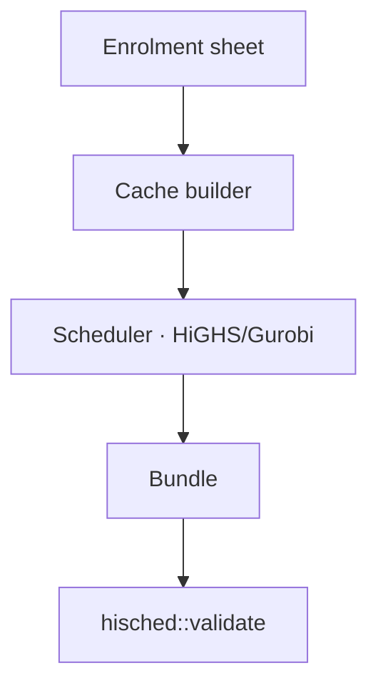

# System specs — overview

The living map of what the system does. Kept current by the archive step of
every implementation change. Investigations never write here.

## Context

## Capabilities
| Capability | What it does | Spec | Diagram |
|------------|--------------|------|---------|
| _(none yet — seeded as changes ADD them)_ | | | |
