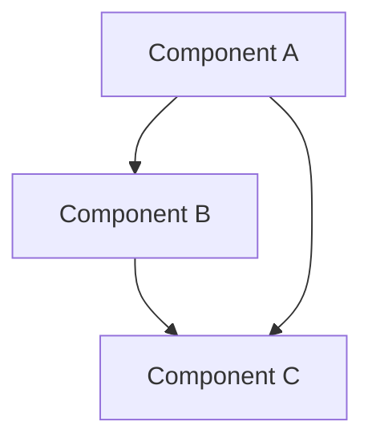
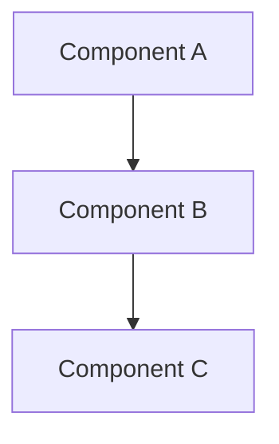
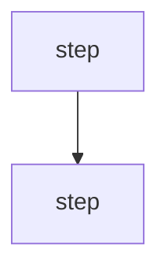

# Diagrams — <system / process>

<!--
  This document holds ONE graph shown two ways:
  - ## System diagram : the exploded, flat picture — every component + edge in one graph.
                        MACHINE-FACING. trace-check runs on this. Keep it in Mermaid.
  - ## Overview       : small high-level view (subset / grouping of the System diagram).
  - ## <box> sections : one detail section per Overview box, zooming in. HUMAN-FACING.

  1-1 RULE — the exploded and the layered views are the SAME graph at different zooms:
  - Every node in ## System diagram appears in the layered view (Overview or a detail section).
  - Every node in the layered view exists in ## System diagram. No orphans either way.
  - Every edge in ## System diagram is represented in the layered view (an Overview edge,
    a detail-internal edge, or a boundary edge). No layered edge missing from System.
  - A detail section's in/out arrows MUST equal that box's arrows in the Overview.
  trace-check verifies this automatically — so keep ## System diagram parseable (Mermaid).
-->

## System diagram
<!-- The exploded picture. Complete and flat: every component and every edge, one graph.
     Do not shrink it — this is what trace-check walks Gherkin scenarios across. -->

---

## Overview
<!-- The same graph, high level. <= 7-9 boxes; group and push internals into detail sections. -->
- What it does: <2-3 plain-language bullets>

- Reading it: <one-line walk of the flow>
- Detail below: A, B, C — one section each.

## A — Component A
- Does: <short bullets, plain language, no jargon>
- Takes in: <must match A's incoming arrows in Overview + System diagram>
- Sends out: <must match A's outgoing arrows in Overview + System diagram>

## B — Component B
- Does: <bullets>
- Takes in: <matches B's incoming arrows>
- Sends out: <matches B's outgoing arrows>

## C — Component C
- Does: <bullets>
- Takes in: <matches C's incoming arrows>
- Sends out: <matches C's outgoing arrows>

