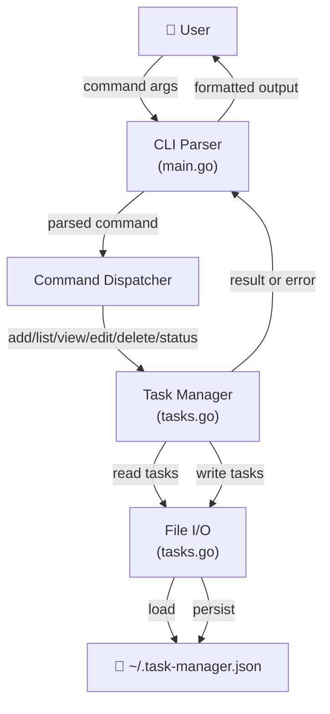
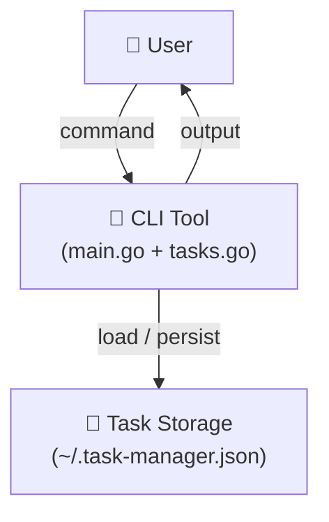
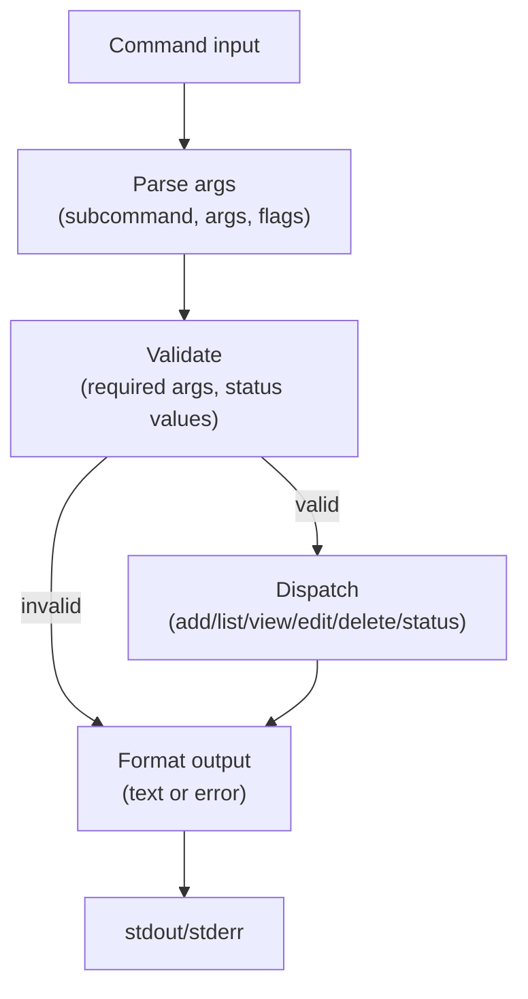
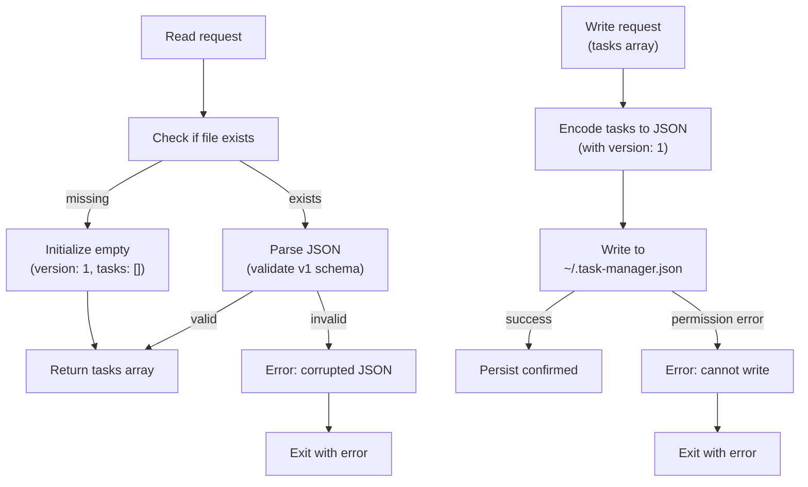

# Diagrams — task-manager-cli

## System diagram

---

## Overview

- Standalone CLI tool that reads tasks from a JSON file, applies mutations in-memory, and persists changes immediately
- User runs commands (`tm add`, `tm list`, `tm delete`, etc.); each invocation loads, modifies, saves, and exits
- All state lives in `~/.task-manager.json`; no network, no background processes

- Reading it: User invokes a command → CLI loads tasks, applies logic, saves → output returned to user.
- Detail below: CLI Tool, Task Storage.

## CLI Tool

- Does: Parses command-line arguments; dispatches to task operations; formats and displays results; handles all user I/O and validation
- Takes in: Shell command with subcommand, arguments, and optional flags from the user
- Sends out: Formatted task data or error messages to stdout/stderr; exit code 0 on success, non-zero on error

**Internal flow:**

## Task Storage

- Does: Stores tasks as JSON in `~/.task-manager.json`; handles read/write with error checking; manages file creation on first use
- Takes in: Tasks to persist (from CLI after mutations); requests to load tasks
- Sends out: Task data (on load); confirmation of successful save; error messages (corrupted JSON, permission denied, etc.)

**Internal structure:**

